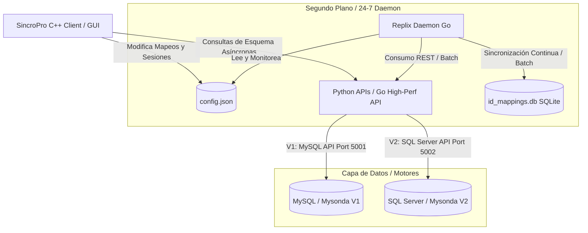

# SincroPro 🚀
### *Suite de Sincronización y Migración Visual Multimotor en C++, Go y Python*

SincroPro es un ecosistema industrial de migración y sincronización de datos diseñado para operar en segundo plano con la máxima eficiencia y fiabilidad. Combina la potencia y portabilidad nativa de **C++17**, la concurrencia y velocidad de **Go**, y la flexibilidad de **Python** para ofrecer una solución desacoplada de extremo a extremo.

Con SincroPro, cualquier administrador de sistemas o desarrollador Junior puede diseñar esquemas de mapeo relacionales complejos de forma visual mediante conexiones curvas interactivas de Bézier, dejando que el demonio autónomo se encargue de la reconciliación y replicación en segundo plano de manera continua (24/7).

---

## 📐 Arquitectura del Ecosistema

SincroPro implementa una arquitectura híbrida de tres niveles (*Three-Tier Architecture*) que desacopla la presentación, la orquestación y el acceso a datos:



### 1. Cliente de Configuración y Mapeo Visual (C++ / Dear ImGui)
Es la puerta de entrada para el usuario. Permite configurar servidores, intervalos de refresco y realizar el mapeo de columnas.
* **Interfaz de Mapeo Bézier Interactiva:** En lugar de formularios áridos, la interfaz presenta los campos de la tabla origen y destino lado a lado. Al seleccionarlos, dibuja curvas **Bézier cúbicas con efecto de sombreado y brillo neon (Cian/Púrpura)** que representan la relación física de los datos.
* **Sin Dependencias Externas en Windows:** Para la comunicación HTTP, implementa un cliente nativo sobre la API del sistema operativo (`WinHTTP`). No requiere empaquetar DLLs de `libcurl` o SSL adicionales, lo que resulta en un binario único ligero y ultra-portátil. En entornos Linux, el código realiza un fallback automático a `libcurl` bajo directivas de compilación condicional.
* **Renderizado Asíncrono Multihilo:** Para evitar retrasos e interrupciones en la interfaz gráfica, el cliente inicializa hilos de trabajo independientes al solicitar esquemas de base de datos remotos, manteniendo siempre el renderizado de la UI a 60 FPS estables.

### 2. Capa de Base de Datos Agnóstica (APIs Desacopladas)
SincroPro no se conecta directamente a los motores de bases de datos desde el cliente visual. En su lugar, utiliza endpoints de API HTTP unificados (implementados en Python o Go).
* **Seguridad de Credenciales y GitIgnore:** Por motivos de seguridad, los scripts de la API de Python (`API/Mysonda/*.py`) contienen credenciales sensibles de producción y **están excluidos del repositorio Git mediante `.gitignore`**. Solo el demonio y APIs de Go se encuentran cargados en el control de versiones.
* **Traducción Universal de Tipos:** Resuelve incompatibilidades comunes entre tipos de datos (como UUIDs, fechas en formato ISO, Decimales a Floats, y codificaciones especiales). Cualquier tipo de dato se normaliza a un formato JSON estándar que la capa de API escribe de manera adecuada en su motor respectivo.
* **Caché de Esquema Inteligente (`schema_cache.json`):** Optimiza las llamadas reflexivas al diccionario de la base de datos de producción mediante un sistema de almacenamiento temporal en disco con expiración dinámica.

### 3. Demonio de Replicación Autónoma 24/7 (Go / Replix)
El núcleo operativo de sincronización en caliente se encuentra implementado en Go y está disponible en el repositorio ([main.go](file:///c:/Users/MSI/Documents/SincroPro/API/MySonda-GO/main.go)).
* **Funcionamiento en Segundo Plano Continuo:** Diseñado para correr como un demonio oculto o servicio del sistema. Lee constantemente la configuración y estado activo del archivo `config.json` compartido con el cliente C++.
* **Pools de Conexiones de Alto Rendimiento:** Administra de manera eficiente la concurrencia a través de pools de conexiones altamente configurables (`sql.Open`) que regulan picos de carga.
* **Seguimiento e Integridad Referencial (SQLite local):** A través del rastreador `id_mappings.db`, Replix conoce exactamente qué registros ya han sido migrados. Al ejecutar la lógica de sincronización:
  1. Verifica si el registro tiene correspondencia en el destino (ejecuta un **UPDATE / Upsert**).
  2. Si no la tiene, realiza un **INSERT** y registra la equivalencia de identificadores de forma transaccional.
  3. Resuelve relaciones jerárquicas mediante directivas `translateViaTable`. Si un registro hijo depende de un registro padre que no ha sido migrado, el demonio pausa temporalmente esa fila hasta que se complete la dependencia, garantizando la consistencia relacional.

---

## ⚡ Características Destacadas

| Característica | C++ (Client/GUI) | Go (Replix / Daemon API) | Python (Alternative APIs) |
|---|---|---|---|
| **Velocidad** | Excepcional (Dear ImGui directo a GPU con OpenGL) | Ultra-rápido (Goroutines nativas, I/O no bloqueante) | Rápido (Basado en scripts ligeros y pyodbc) |
| **Rol en SincroPro** | Diseño visual de mapeo e inicio manual. | Replicación robusta 24/7 en segundo plano y API de alto rendimiento. | API ligera multi-hilo para desarrollo local e independiente. |
| **Integridad de Datos** | Visualización en tiempo real de inconsistencias. | Gestión relacional estricta, traducción de FK y base de datos de mapeo SQLite. | Validación de payload y normalización de tipos nativos de DB. |

---

## 🛠️ Configuración y Puesta en Marcha

SincroPro está estructurado para que configurar los entornos requiera el mínimo esfuerzo de código:

### 1. Configuración de Credenciales
> [!IMPORTANT]
> **Nunca expongas ni subas credenciales reales al repositorio de Git.** SincroPro está preparado para cargar la configuración de forma segura a través de variables de entorno del sistema o archivos locales ignorados por el control de versiones.

#### En el Backend en Go (`main.go`):
Se recomienda configurar las credenciales exportando las variables de entorno `MYSQL_CONN_STR` y `MSSQL_CONN_STR` en tu sistema operativo, o configurando variables locales seguras:
```go
// MySQL Connection Pool (BD Origen - V1)
mysqlConnStr := getEnv("MYSQL_CONN_STR", "usuario:contrasena@tcp(servidor_mysql:puerto)/nombre_bd?parseTime=true&charset=utf8")

// SQL Server Connection Pool (BD Destino - V2)
mssqlConnStr := getEnv("MSSQL_CONN_STR", "server=servidor_mssql;user id=usuario;password=contrasena_segura;database=nombre_bd;encrypt=disable;TrustServerCertificate=true;")
```

#### En los scripts de Python (No subidos a Git):
Dado que estos scripts locales están excluidos del repositorio, puedes definir con seguridad los parámetros de conexión locales en el diccionario `DB_CONFIG` dentro de los archivos `mysondav1_api.py` y `mysondav2_api.py` si trabajas localmente.

### 2. Ejecutar las APIs y Demonio en Segundo Plano

#### Usando el Entorno Go (Recomendado para Producción):
Para ejecutar los servicios del API y el demonio Replix en un único binario ejecutable optimizado:
```bash
cd API/MySonda-GO
# Compilar el binario
go build -o MySonda-GO.exe main.go
# Instalar y registrar como demonio de inicio en segundo plano en Windows
instalar_demonio_autostart.bat
```

#### Usando el Entorno Python (Recomendado para Desarrollo):
```bash
cd API/Mysonda
# Ejecutar los servidores de desarrollo de manera conjunta
run_apis.bat
```

### 3. Compilación y Uso del Cliente C++
La compilación del cliente visual es directa y genera un único binario ejecutable autónomo.

```bash
# Generar archivos de proyecto CMake
cmake -B build

# Compilar en modo de optimización Release
cmake --build build --config Release
```
El ejecutable optimizado se encontrará en `build/bin/Release/SincroPro.exe`.

---

## 💻 Flujo de Trabajo para un Junior / No Programador
1. **Abrir el Cliente:** Abre `SincroPro.exe`. Verás el panel con un diseño oscuro glassmorphic.
2. **Definir Tablas:** Selecciona la tabla de origen (MySQL) y la tabla de destino (SQL Server) en los desplegables.
3. **Mapear Columnas Visualmente:** Haz clic sobre una columna del lado izquierdo, luego clic en la columna del lado derecho. Se creará una línea Bézier cian que confirmará el flujo de información.
4. **Marcar Claves Principales:** Define cuál columna es la llave primaria e indica si posee un auto-generador de IDs.
5. **Activar Sincronización:** Guarda la sesión y establécela como activa. El demonio autónomo (en Go) detectará la sesión de forma inmediata y comenzará a sincronizar los datos de fondo cada X segundos, manteniendo un log detallado de transacciones.
